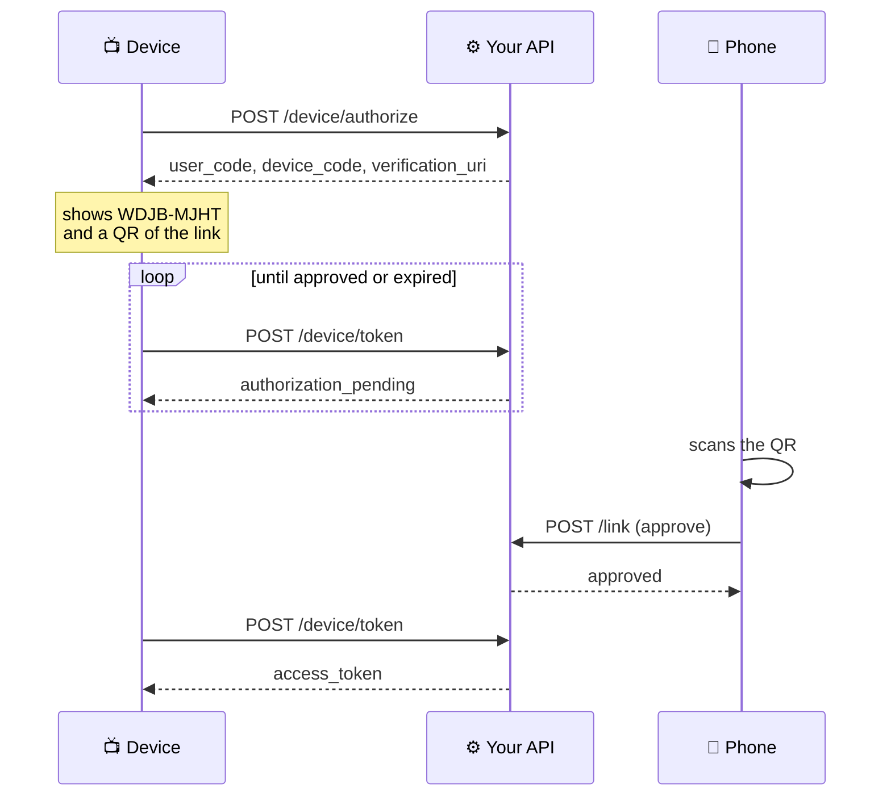
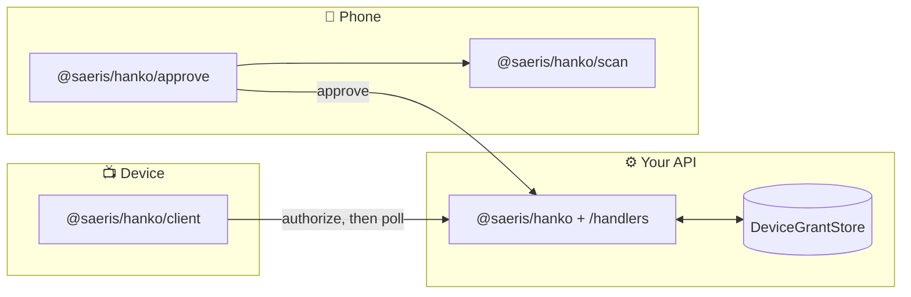

<div align="center">

# 💮 hanko「判子」

[![CI status][ci_badge]][ci] [![npm][npm_badge]][npm] [![License][license_badge]][license]

QR-assisted device sign-in for screens without a keyboard, with a QR decoder of its own.

</div>

---

**判子** (_hanko_) is the personal seal used in Japan in place of a signature —
pressed once to authorize something on your behalf. Which is the whole flow: a
TV asks, you approve it from your phone, the TV is signed in.

## 🎯 What it does

An implementation of [RFC 8628][rfc], the OAuth 2.0 Device Authorization Grant
— the flow behind Plex and Steam's TV sign-in, and Discord's device
authorization. A device that is awkward to type on shows a short code and a QR;
the user authorizes on a phone they are already signed in on; the device polls
until it hears back.



Three entry points, one per device in the flow. No UI components for any of
them — state and lifecycle hooks instead, so React, Vue, Svelte, Solid, Angular
and React Native each bind it with their own conventions.

| Entry                         | Runs on                | Gives you                                  |
| ----------------------------- | ---------------------- | ------------------------------------------ |
| `@saeris/hanko` + `/handlers` | your API               | grant lifecycle, `Request`→`Response` glue |
| `@saeris/hanko/client`        | the device signing in  | poll loop, QR rendering                    |
| `@saeris/hanko/approve`       | the device granting it | QR reading, confirmation challenges        |

## 📷 The QR decoder

`@saeris/hanko/scan` reads QR codes. Pixels in, string out — no camera, no DOM,
no dependencies — so the same code runs in a browser, in a worker, on a server,
or in a test.

It exists because every JavaScript alternative is unmaintained: jsQR's last code
commit was August 2021, qr-scanner's November 2022, and `BarcodeDetector` is
still a WICG incubation that Safari has never shipped.

Measured against the 718-image [BoofCV benchmark][boofcv] — photographs, not
renders:

| Decoder   | Recognition |
| --------- | ----------- |
| **hanko** | **74.4%**   |
| BoofCV    | 60.69%      |
| ZBar      | 38.95%      |
| ZXing     | 31.87%      |
| jsQR      | 24.8%       |

### Decoding one image

```ts
import { createQrDecoder, toGray } from "@saeris/hanko/scan";

const decoder = createQrDecoder();
const symbol = decoder.decode(toGray(rgba, width, height));

symbol?.value; // the payload, or null if nothing was found
```

### Scanning with a camera

Three pieces: a worker holding the decoder, something to turn a camera into
greyscale frames, and a loop between them.

The worker is not optional. The retry ladder deliberately outruns its own time
budget — the budget is checked between attempts, not inside them — so a
synchronous decode stalls the preview on exactly the frames someone is lining
up.

```ts
// decoder.worker.ts
import { serveDecoder } from "@saeris/hanko/scan/worker";

// No time budget: a worker has no preview to block, so the ladder may run to
// exhaustion. Worth roughly twenty points of recognition over the 120ms a
// synchronous decode has to respect.
serveDecoder(self, { timeBudgetMs: 0 });
```

```ts
// camera.ts
export const openCamera = async (video: HTMLVideoElement) => {
  const stream = await navigator.mediaDevices.getUserMedia({
    // A preference, not a guarantee — a laptop with one camera ignores it.
    video: { facingMode: { ideal: `environment` } },
    audio: false
  });

  video.srcObject = stream;
  // Without this iOS opens the system player full-screen instead of playing
  // inline, and there is no preview to aim with.
  video.setAttribute(`playsinline`, ``);
  await video.play();

  const canvas = document.createElement(`canvas`);
  // `willReadFrequently` matters: without it the browser keeps the canvas on
  // the GPU and every `getImageData` is a synchronous readback, which is the
  // most expensive thing in this loop.
  const context = canvas.getContext(`2d`, { willReadFrequently: true })!;

  return {
    grab: () => {
      const width = video.videoWidth;
      const height = video.videoHeight;
      // Zero before the first paint, and on iOS while the element is paused.
      if (width === 0 || height === 0) return null;

      canvas.width = width;
      canvas.height = height;
      context.drawImage(video, 0, 0);
      const { data } = context.getImageData(0, 0, width, height);

      // Converted here rather than in the worker: it quarters the bytes
      // transferred per frame.
      const grey = new Uint8ClampedArray(width * height);
      for (let i = 0, p = 0; i < grey.length; i++, p += 4) {
        grey[i] = (data[p] * 77 + data[p + 1] * 150 + data[p + 2] * 29) >> 8;
      }

      return { data: grey, width, height };
    },

    stop: () => {
      for (const track of stream.getTracks()) track.stop();
      video.srcObject = null;
    }
  };
};
```

```ts
// the loop
import { createWorkerScanner } from "@saeris/hanko/scan";
import { openCamera } from "./camera";

const camera = await openCamera(document.querySelector(`video`)!);
const scanner = createWorkerScanner(
  new Worker(new URL("./decoder.worker.ts", import.meta.url), {
    type: `module`
  })
);

let scanning = true;

while (scanning) {
  const frame = camera.grab();

  if (frame !== null) {
    // Awaited one at a time on purpose. A camera produces frames faster than
    // they decode, and `scan` drops anything offered while a decode is in
    // flight rather than queueing it — the next frame is always a better
    // input than a backlogged one.
    const symbol = await scanner.scan(frame);

    if (symbol !== null) {
      console.log(symbol.value);
      scanning = false;
      break;
    }
  }

  // Yield to the compositor. The decode happens on another thread, but this
  // loop still runs on the main one.
  await new Promise((resolve) => requestAnimationFrame(resolve));
}

scanner.close();
camera.stop();
```

A scanned payload is untrusted input. If you turn one into a link, restrict it
to `http:` and `https:` and show the raw text beside it — `new URL()` happily
accepts `javascript:`.

For a camera that should keep trying across frames rather than exhausting the
ladder on one, `createProgressiveScanner` spends a small budget per frame and
raises it while a symbol is in view.

Coverage per condition, and the negative results behind it, live in
[plan/qr-coverage.md](plan/qr-coverage.md). Both move often.

## 🏷️ Product barcodes

`@saeris/hanko/scan/linear` reads the EAN/UPC family — what is printed on retail
packaging. Same shape as the QR decoder, same binarization underneath, separate
entry point so neither pays for the other's tables.

It is **one symbology wearing four names**: UPC-A is an EAN-13 whose first digit
is zero, UPC-E is a compressed EAN-13, and EAN-8 is the same encoding at a
shorter length. One decoder reads all of them and reports which shape it found,
because that is what callers match on.

```ts
import { createLinearDecoder } from "@saeris/hanko/scan/linear";
import { toGray } from "@saeris/hanko/scan";

const decoder = createLinearDecoder();
const symbol = decoder.decode(toGray(rgba, width, height));

symbol?.format; // "upc_a" | "ean_13" | "ean_8" | "upc_e"
symbol?.value; // "036000291452" — twelve digits for a UPC-A, as printed
```

A UPC-A comes back as twelve digits rather than thirteen with a leading zero,
because that is what is on the package and what a product database is keyed by.

### What it covers

More than the name suggests, because several things are EAN-13 underneath:

| On the shelf             | Reads as | Note                                  |
| ------------------------ | -------- | ------------------------------------- |
| Groceries, bottles, cans | `ean_13` |                                       |
| US and Canadian retail   | `upc_a`  | reported as the twelve digits printed |
| Japanese products (JAN)  | `ean_13` | JAN _is_ EAN; prefixes 45 and 49      |
| Books (ISBN-13)          | `ean_13` | prefix 978/979                        |
| Magazines (ISSN)         | `ean_13` | prefix 977                            |
| Small items              | `ean_8`  |                                       |

Not covered: **Code 128** and **ITF-14**, which are genuinely different
symbologies. ITF-14 marks shipping cases rather than the packaging a person
photographs.

`describeGtin` names what the leading digits are allocated for, which
distinguishes a book from a bottle from a shop's own weighed-produce label —
the last of which will never match a product database, however long a caller
waits for it to.

```ts
import { describeGtin } from "@saeris/hanko/scan/linear";

describeGtin(`4901234567894`); // { label: "GS1 Japan" }
describeGtin(`9784873115658`); // { label: "Book (ISBN)", note: … }
describeGtin(`2001234567893`); // { label: "In-store", note: … }
```

A GS1 prefix names the organisation a company registered with, **not** where
anything was made — a company can license a prefix in one country and
manufacture in another.

### How well it reads

The [ArTe-Lab Medium 1D corpus][artelab] — 430 photographs of EAN-13 barcodes
taken with camera phones, split by whether the camera had autofocus:

| Subset            | Images | Correct   | Misread |
| ----------------- | ------ | --------- | ------- |
| With autofocus    | 215    | **92.1%** | 0       |
| Without autofocus | 215    | **27.0%** | 0       |
| Total             | 430    | **59.5%** | **0**   |

The misread column is the one to watch. A QR symbol reconstructs or it does
not, so "read" and "read correctly" are one number; this family has no
correction, so they are two, and a confident wrong answer is far worse than
none.

The autofocus split is the whole story: a barcode in focus reads nine times in
ten, one that is not reads a quarter of the time. The lever is **sampling more
rows**, not processing any one row harder — the blurry half runs 18% at 24
rows, 26% at 64 and 35% at 256. Blurring, downscaling and enlarging each moved
it by nothing — but averaging each pixel with the ones directly ABOVE and BELOW
is worth 3 points, because a barcode is constant down its height, so that
averages repeated measurements of one bar rather than smearing neighbouring
ones together. ZXing reaches the same conclusion from the other side:
its `tryHarder` mode drops the row step from height/32 to height/256.

Worth knowing before turning the knobs: loosening the pattern tolerance buys
recognition and pays in **misreads**. At 0.85 it reads more and returns 13
confidently wrong numbers across a sample; at 0.7, one. The defaults go the
other way — four rows must agree rather than two, costing about a point on
focused images and three on blurry ones, and removing every misread.

For scale: the authors of this corpus needed a neural network to read its
no-autofocus half at all, having found the open-source libraries of the day
could not. 26% classically is not obviously far from what the approach allows.

```bash
yarn corpus:barcodes  # fetch the corpus (~226 MB, CC BY 3.0)
yarn bench:barcodes   # run it
```

### Why it asks two rows to agree

This family carries **no error correction**. A QR symbol can lose a third of
itself and still decode; a linear barcode either reads or does not, and the
check digit — one digit in ten — is the only thing between a wrong answer and a
_confident_ wrong answer.

That is not theoretical. Measured against the QR corpus, which contains no
linear barcodes at all, accepting a single row produced a confident EAN-8 on
**3 of 51** photographs: dense QR modules are alternating runs, and occasionally
eight of them satisfy both the pattern match and the check digit.

A real barcode is many pixels tall and reads identically on every row through
it. A coincidence does not survive being asked twice, so the decoder requires
agreement across rows — which took that to **0 of 51** while still reading at
one pixel per module, under blur, at low contrast, upside down, and with no
quiet zone.

## 🏗️ How it works

hanko owns the **grant lifecycle** and nothing else. It never mints sessions or
touches your user table: it tells you a grant was approved and by whom, and
issuing a token from that is your application's decision.



### Decisions worth knowing

- **Zero runtime dependencies.** The grant lifecycle is the product; rendering a
  QR is a different class of problem, so it sits behind `@saeris/hanko/qr` and
  defers to [`etiket`][etiket] as an optional peer. Reading one had no
  maintained option at all, which is why `/scan` exists.
- **WinterTC primitives only.** `Request`, `Response`, `crypto.getRandomValues` —
  so one build runs on Node, Deno, Bun, Cloudflare Workers and in a browser,
  with no adapter per runtime.
- **A short code is a small keyspace.** That is the deliberate trade for
  readability, and [RFC 8628 §5.1][rfc-security] **requires you to rate-limit
  attempts**. hanko does not do it for you: that belongs at your HTTP boundary,
  where you can see IPs.
- **Approval is two steps, not one.** Scanning a code that says "approve this"
  and approving it are separate, because a QR is a link anyone can point a
  camera at. `/approve` ships the confirmation challenge that closes that gap.
- **The store is four methods.** `create`, `findByDeviceCode`, `findByUserCode`
  and `update`, plus an optional `prune` — small enough that an adapter for your
  database is a short file. The bundled memory store is for development only.

## 📦 Install

```sh
yarn add @saeris/hanko
```

Add `etiket` only if you render the device screen:

```sh
yarn add etiket
```

Codes follow the spec's worked example: 8 characters from a 20-consonant
alphabet, shown as `WDJB-MJHT`. No vowels, so a code cannot spell a word; no
digits, so there is no `0`/`O` or `1`/`l`/`I` to misread.

## 🔧 Examples

The whole sign-in flow, wired end to end, lives in
[`examples/astro`](examples/astro) — three surfaces, a store, rate limiting and
the confirmation challenge, with the framework-specific parts explained in
[its README](examples/astro/README.md). That is the reference for building the
flow; this README covers the pieces rather than the assembly.

More are planned — Next.js first, mirroring the Astro one closely enough to
diff, then other frameworks and UI stacks.

| Route            | What it is                                                           |
| ---------------- | -------------------------------------------------------------------- |
| `/`              | the map — what to open where, and whether the URL reaches a phone    |
| `/tv`            | the device screen — a short code and a QR for a pending grant        |
| `/signin`        | the phone's own sign-in; this identity is what the device inherits   |
| `/account`       | approved devices, and revoking them                                  |
| `/link`          | the approval page — scans that QR, or takes a typed code             |
| `/scanner`       | a bare scanner, showing the payload raw and as a link                |
| `/scanner-debug` | the same, reporting each stage on screen for a phone with no console |

```bash
yarn demo        # builds the library, then serves the example
yarn demo:share  # the same, over TLS so a phone can reach it
```

A camera needs a secure context, so a bare LAN IP will not do — `demo:share`
puts a TLS proxy in front, which is what makes the phone half testable at all.

## 🧪 Checks

| What           | Command             | Notes                                           |
| -------------- | ------------------- | ----------------------------------------------- |
| Everything     | `vp run ci`         | `vp pack && vp check && vp test`, what CI runs. |
| Tests          | `vp test`           | Pure TypeScript; never imports react-native.    |
| Recognition    | `yarn bench:corpus` | The 718-image corpus, sharded across workers.   |
| Decode profile | `yarn bench`        | A still image, for `deoptkit`.                  |

`vp pack` has to run before `vp check`: the example resolves `@saeris/hanko`
through the `exports` map, which points at `dist/`, so a clean checkout cannot
typecheck it until the library is built.

## 🚀 Releasing

Driven by [bumpy][bumpy]. Every change carries a **bump file** in `.bumpy/`
saying what moved and how far, so the changelog cannot fall behind the code.

```bash
yarn bumpy add
```

Merging that opens a **Version PR**; merging _that_ tags the release and
publishes to npm over OIDC trusted publishing, so no token is stored. The
example deploys to Vercel on push, independently of releases.

## 🥂 License

[MIT][license] © [Drake Costa][personal-website]

[rfc]: https://datatracker.ietf.org/doc/html/rfc8628
[rfc-security]: https://datatracker.ietf.org/doc/html/rfc8628#section-5
[etiket]: https://github.com/productdevbook/etiket
[boofcv]: https://boofcv.org/index.php?title=Performance:QrCode
[artelab]: http://artelab.dista.uninsubria.it/downloads/datasets/barcode/medium_barcode_1d/medium_barcode_1d.html
[bumpy]: https://github.com/dmno-dev/bumpy
[ci_badge]: https://github.com/Saeris/hanko/actions/workflows/ci.yml/badge.svg
[ci]: https://github.com/Saeris/hanko/actions/workflows/ci.yml
[npm_badge]: https://img.shields.io/npm/v/@saeris/hanko.svg
[npm]: https://www.npmjs.com/package/@saeris/hanko
[license_badge]: https://img.shields.io/badge/license-MIT-blue.svg
[license]: https://github.com/Saeris/hanko/blob/main/LICENSE.md
[personal-website]: https://saeris.gg
